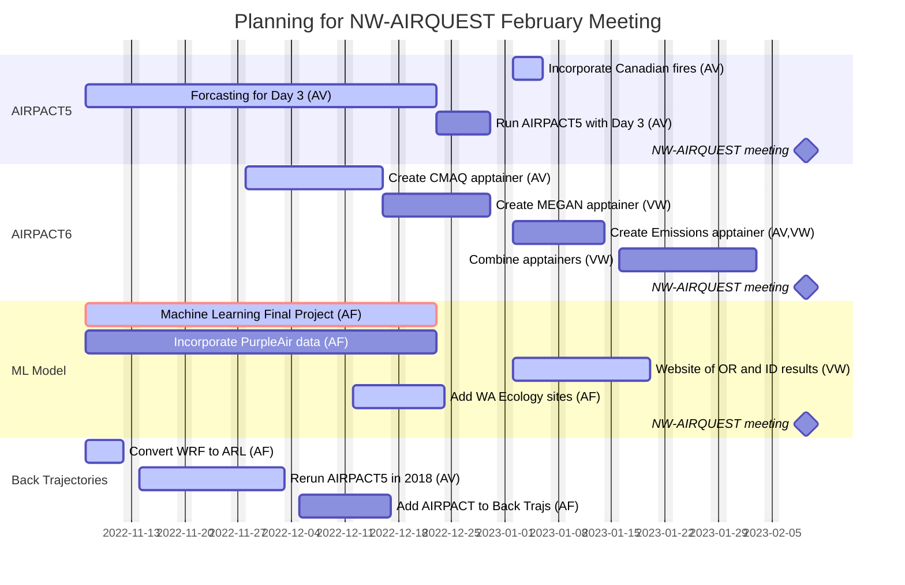

# Walden Group Planning

```mermaid
gantt
    dateFormat  YYYY-MM-DD
    title       Planning for NW-AIRQUEST February Meeting
    excludes    weekends

  section AIRPACT5
    Incorporate Canadian fires (AV)         :active,        s1t1,   2023-01-02, 4d
    Forcasting for Day 3 (AV)                :active,        s1t2,   2022-11-07, 2022-12-23
    Run AIRPACT5 with Day 3 (AV)            :               s1t3,   after s1t2, 5d
    NW-AIRQUEST meeting                     :milestone,             2023-02-09, 1d

  section AIRPACT6
    Create CMAQ apptainer (AV)              :active,        s2t1,   2022-11-28, 14d
    Create MEGAN apptainer (VW)             :               s2t2,   after s2t1, 10d
    Create Emissions apptainer (AV,VW)      :               s2t3,   2023-01-02, 10d
    Combine apptainers (VW)                 :               s2t4,   after s2t3, 14d 
    NW-AIRQUEST meeting                     :milestone,             2023-02-09, 1d

  section ML Model
    Machine Learning Final Project (AF)     :crit,active,   s3t1,   2022-11-07,2022-12-23
    Incorporate PurpleAir data (AF)         :               s3t2,   2022-11-07,2022-12-23
    Website of OR and ID results (VW)       :active,        s3t3,   2023-01-02, 14d
    Add WA Ecology sites (AF)               :active,        s3t4,   2022-12-12, 10d 
    NW-AIRQUEST meeting                     :milestone,             2023-02-09, 1d

  section Back Trajectories
    Convert WRF to ARL (AF)                 :active,        s4t1,   2022-11-07, 5d
    Rerun AIRPACT5 in 2018 (AV)             :active,        s4t2,   after s4t1, 15d
    Add AIRPACT to Back Trajs (AF)          :               s4t3,   after s4t2, 10d
```
